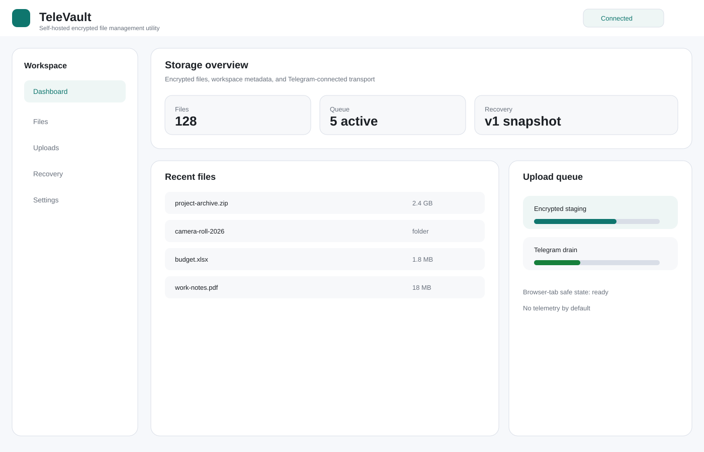
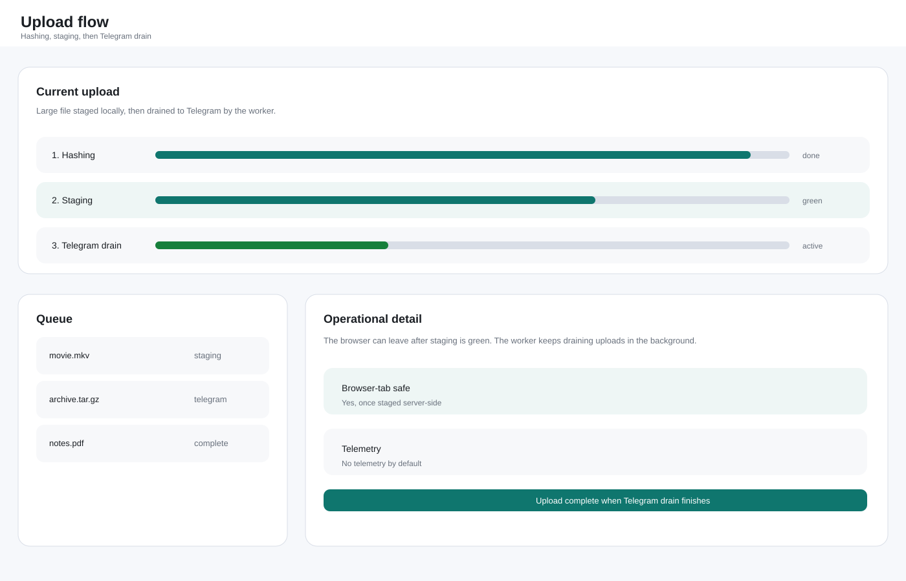
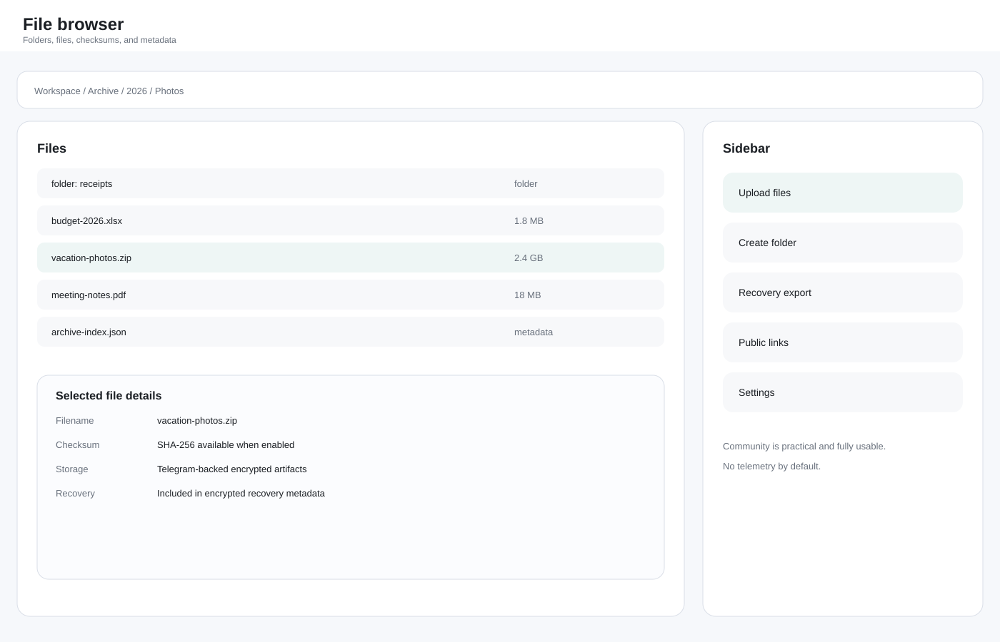

# TeleVault

Self-hosted encrypted file management utility with Telegram integration.

Built for self-hosters, homelabs, Linux users, privacy-focused users, power users, and backup and archival enthusiasts.

> TeleVault is an independent self-hosted utility and is not affiliated with Telegram.

## Product Identity

- Primary identity: self-hosted encrypted file management utility.
- Secondary identity: encrypted file management vault.
- Telegram integration is used as a connected backend and synchronization layer.

## Why TeleVault Exists

TeleVault exists for people who want a practical encrypted file vault they control themselves:

- personal encrypted archives;
- homelab-managed file storage;
- Telegram-backed transport for a self-hosted vault;
- a workflow that keeps ownership and portability in the user's hands.

## Features

- encrypted file storage;
- Telegram integration backend;
- self-hosted deployment;
- metadata indexing;
- recovery bundles;
- automation tooling;
- multi-account workflows in Pro;
- advanced synchronization in Pro.

## Edition Summary

- Community (AGPL-3.0): complete personal edition, one workspace, one connected Telegram account.
- Pro (planned): advanced workflows, advanced synchronization, multi-account management, automation features, maintenance features, advanced integrations.
- Team (roadmap): future collaboration tooling, shared workspaces, policy controls, and administrative workflows.

Community remains fully usable and practical for real deployments. It is not a demo edition and should not be artificially degraded.

## Quick Start

1. Create `.env` from `.env.example` and fill in the required secrets and Telegram API values.
2. Start the stack with `docker compose up -d --build`.
3. Open `http://localhost:8080/`.
4. Complete the first Telegram login flow with phone/code or QR, and 2FA if your account uses it.
5. Create your first workspace folder, then upload files.

The web app listens on `8080`. If you use a local development override, Postgres and Valkey are typically exposed on `5432` and `6379` as well.

Minimal configuration:

- `APP_SESSION_SECRET`;
- `REFRESH_TOKEN_PEPPER`;
- `APP_AGE_IDENTITY`;
- `TELEGRAM_SESSION_KEY`;
- `TELEGRAM_API_ID`;
- `TELEGRAM_API_HASH`;
- `POSTGRES_PASSWORD`.

## Architecture

```text
Client
  ↓
TeleVault API
  ↓
Encryption and metadata layer
  ↓
Telegram integration backend
  ↓
Connected Telegram account
```

The API handles authentication, metadata, encryption, and upload/download coordination. Telegram is the transport and storage backend for encrypted artifacts.

## Visual Preview





## Security and Privacy

- Telegram stores encrypted artifacts (ciphertext), not original plaintext files.
- Processing may require temporary processing-time access depending on deployment and configuration.
- Current architecture does not provide full zero-knowledge guarantees.
- No telemetry by default.

See:

- [SECURITY.md](./SECURITY.md)
- [Threat model](./docs/threat-model.md)

## Compliance and Disclaimer

TeleVault is not affiliated with Telegram.

Users are responsible for complying with Telegram Terms of Service.

TeleVault does not provide hosting/storage infrastructure; users connect their own Telegram accounts.

## Contributing

See [CONTRIBUTING.md](./CONTRIBUTING.md) for coding style, issue guidance, pull request expectations, and security disclosure handling.
