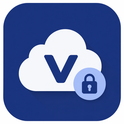
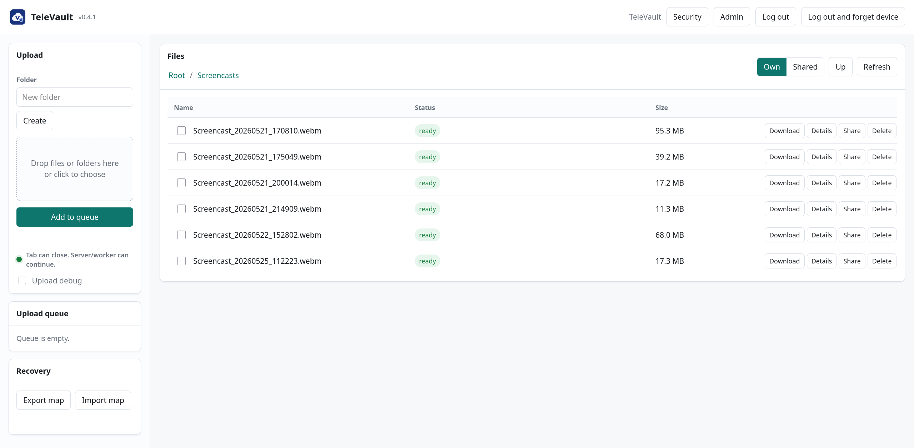
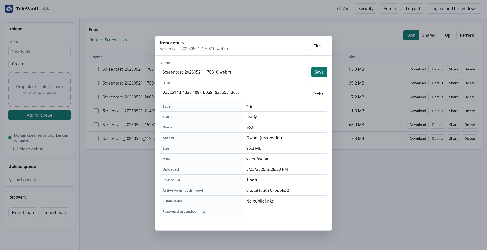
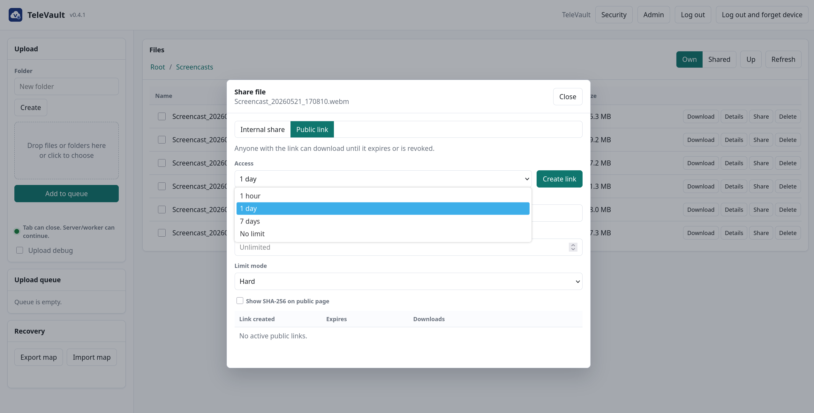

<div align="center">
  
  <h1>TeleVault</h1>
  <p><strong>Secure self-hosted encrypted file platform with Telegram integration.</strong></p>
  <p>
    <a href="./docs/">Documentation</a> •
    <a href="#quick-start">Quick Start</a> •
    <a href="#features">Features</a> •
    <a href="#roadmap">Roadmap</a>
  </p>
  <p>
    
    
    
    
    
    
  </p>
  
</div>

## What Is TeleVault?

TeleVault is a self-hosted encrypted file management system that uses your own Telegram account as a storage transport backend.

It is built for people who want control: homelabs, private archives, and personal infrastructure where data ownership and operational transparency matter.

The platform combines encrypted file handling, browser UI, Telegram auth, and metadata persistence into one deployable stack.

TeleVault is independent and is not affiliated with Telegram.

## Features

### Core Platform

- Self-hosted deployment via Docker Compose.
- Encrypted upload/download pipeline.
- Folder and file management in web UI.
- Staged uploads with background drain worker.
- Recovery export/import foundation.

### Authentication and Security

- Telegram sign-in: phone/code and QR.
- Telegram two-step password support.
- Local 2FA: TOTP, passkeys (WebAuthn), recovery codes.
- Remembered-device re-entry with local challenge verification.
- Read-only safety mode when Telegram session is disconnected.

### Sharing and Operations

- Public links with password, expiry, revoke, and download limits.
- Internal sharing flows.
- Admin upload settings and policy controls.
- Persistent log files.

### Editions

| Edition | Status | Scope |
| --- | --- | --- |
| Community | Available | One workspace, one connected Telegram account, full personal self-hosted flow |
| Pro | Planned/Commercial | Advanced workflows, automation, multi-account operations |
| Team | Roadmap | Collaboration, shared workspaces, policy controls |

## Screenshots / Demo





## Why TeleVault?

- Keep infrastructure ownership on your side.
- Keep encrypted artifacts in Telegram-backed storage, with local metadata control.
- Avoid hosted lock-in for personal archive workflows.
- Preserve operational clarity: auth, encryption, upload queue, and recovery are visible and auditable in your own deployment.

## Quick Start

```bash
git clone https://github.com/NightSommelier/TeleVault.git
cd TeleVault
cp .env.example .env
docker compose up -d --build
```

Open `http://localhost:8080` and complete first login via Telegram (phone/code or QR).

Recommended first-run step: enable Local 2FA in `Security`.

## Configuration

Minimal required variables in `.env`:

| Variable | Purpose |
| --- | --- |
| `APP_SESSION_SECRET` | Session signing secret |
| `REFRESH_TOKEN_PEPPER` | Refresh-token hash pepper |
| `APP_AGE_IDENTITY` | AGE secret identity for encryption |
| `TELEGRAM_SESSION_KEY` | Encryption key for stored Telegram sessions |
| `TELEGRAM_API_ID` / `TELEGRAM_API_HASH` | Telegram API app credentials |
| `POSTGRES_PASSWORD` | PostgreSQL password for Compose stack |

Telegram client profile (runtime-identification tuning):

- `TELEGRAM_CLIENT_DEVICE_MODEL`
- `TELEGRAM_CLIENT_SYSTEM_VERSION`
- `TELEGRAM_CLIENT_APP_VERSION`
- `TELEGRAM_CLIENT_LANG_CODE`
- `TELEGRAM_CLIENT_SYSTEM_LANG_CODE`

Reverse proxy (example):

- put TLS and access policies in front of `:8080`;
- forward `X-Forwarded-For` only from trusted proxy CIDRs (`TRUSTED_PROXY_CIDRS`);
- keep `SECURE_COOKIE=true` in production.

## Architecture

```text
Browser / CLI
   |
   v
TeleVault API (auth, policies, metadata, encryption orchestration)
   |
   +--> PostgreSQL (metadata, policies, sessions, file maps)
   +--> Valkey (rate limits / queue-related cache)
   +--> Local upload staging
   |
   v
Telegram backend (encrypted artifacts)
```

Supporting services:

- `worker`: drains staged parts to Telegram.
- `cleanup`: removes stale local/Telegram artifacts.

## Tech Stack

- Go (backend services)
- PostgreSQL (primary DB)
- Valkey (queue/rate-limit cache)
- Vanilla JS + CSS embedded web UI
- Telegram MTProto via `gotd/td`
- Docker Compose runtime

## Roadmap

- [x] Telegram auth (phone/code + QR + Telegram two-step password)
- [x] Local 2FA (TOTP + passkeys + recovery codes)
- [x] Remembered-device flow
- [x] Community owner binding and invite-capacity enforcement
- [x] Local signed-license verification
- [ ] Final `v0.4.2` manual smoke closure and release tag
- [ ] Commercial update-right channel hardening (`v0.5.0` target)
- [ ] Payment-provider integration for licensing flow

Detailed roadmap: [ROADMAP.md](./ROADMAP.md)

## Contributing

Contributions are welcome. Start with:

1. [CONTRIBUTING.md](./CONTRIBUTING.md)
2. [docs/development/](./docs/development/)
3. Open issues and roadmap alignment before large feature work

## License

TeleVault uses dual licensing: `AGPLv3 + Commercial License`.

For commercial licensing, contact `sommelier@matrix.co.ua`.

See [LICENSE.md](./LICENSE.md) for details.
